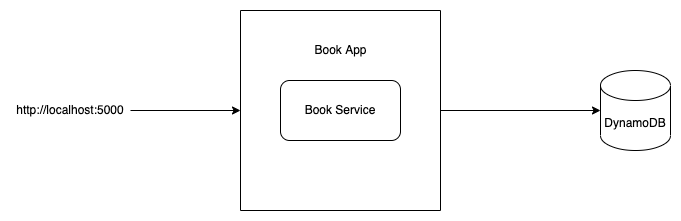
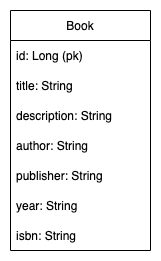

# DynamoDB REST APIs example

>  https://docs.aws.amazon.com/amazondynamodb/latest/developerguide/DynamoDBLocal.DownloadingAndRunning.html

## Create the project directory
> mkdir Your_Directory

> cd Your_Directory

## Create a virtual environment to isolate our package dependencies locally
> python3 -m venv env

> source env/bin/activate  # On Windows use `env\Scripts\activate`

## Install Django and Django REST framework into the virtual environment
> pip install -r requirements.txt

## Set up a new project with a single application
> django-admin startproject books_api

> cd books

> django-admin startapp books

## Run Server
> python manage.py runserver 8081

### Run DynamoDB

>  java -Djava.library.path=./DynamoDBLocal_lib -jar DynamoDBLocal.jar -sharedDb

### Show Tables

>  aws dynamodb list-tables --endpoint-url http://localhost:8000

### Create Table via App

>  http://localhost:5000/createTable

### View Table

> aws dynamodb scan --table-name Book --endpoint-url http://localhost:8000

### Delete Table

>  aws dynamodb delete-table --table-name Book --endpoint-url http://localhost:8000

## Architecture

## ER Diagram

### References
* https://aws.amazon.com/dynamodb/
* https://docs.aws.amazon.com/amazondynamodb/latest/developerguide/DynamoDBLocal.DownloadingAndRunning.html
* https://awsclibuilder.com/home/services/dynamodb
* https://boto3.amazonaws.com/v1/documentation/api/latest/guide/quickstart.html
